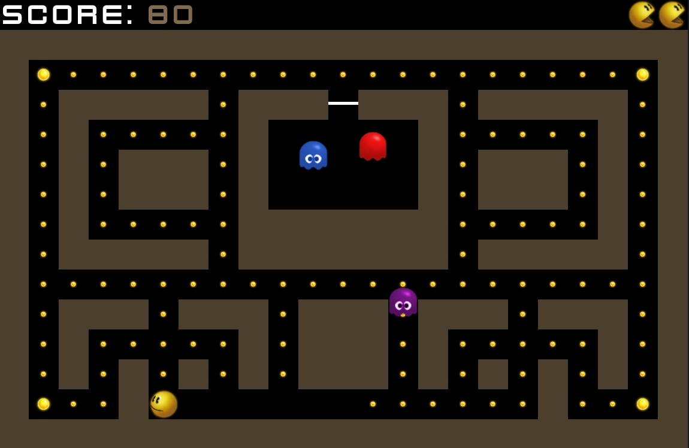

# Pacman

_Pacman written in Rust_

Commands to build/run:

>_All commands execute from the parent folder (where the "Cargo.toml" file exists)_

To build: 
```shell
cargo build --release
```

To run: 
```shell
cargo run
```
## Screenshot
